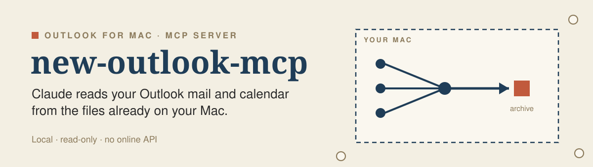
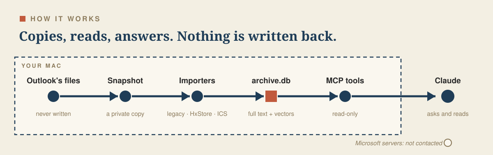
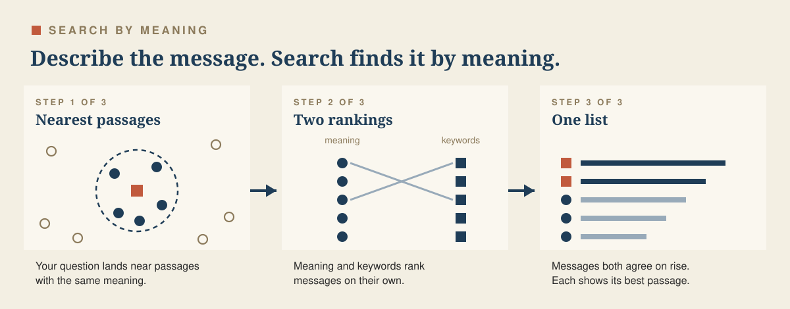

<p align="center"></p>

A local, read-only MCP server that lets Claude search and read your Outlook for Mac mail and calendar. It works only from files Outlook already keeps on your Mac. It uses no online API. Private mail you read through [mcp-hey](https://github.com/michalhron/mcp-hey) can join the same archive, kept apart as its own realm.

## Why it exists

Three things changed at once:

- New Outlook for Mac has no AppleScript, so the usual way to script Outlook is gone.
- Legacy Outlook for Mac can no longer connect to Exchange Online, because Microsoft retired EWS in October 2026.
- The Microsoft 365 (Graph) connector needs an administrator to grant consent. Many universities and companies do not grant it, and some offer no IMAP either.

Outlook still keeps a lot on disk: the frozen archive of the legacy client, New Outlook's cache, and cached attachments. This project copies those files, decodes them into its own searchable archive, and gives Claude read-only tools over that archive. It never talks to Microsoft's servers and never reuses Outlook's tokens.

## What you get

<table>
<tr><td width="50%" valign="top"><b>One archive</b><br>Legacy history and New Outlook's cache in one place, deduplicated. Mail stays after Outlook drops it.</td><td width="50%" valign="top"><b>Keyword search</b><br>Words, phrases, prefixes and filters by sender, folder, account and date.</td></tr>
<tr><td width="50%" valign="top"><b>Search by meaning</b><br>Describe what you remember, in any of about 100 languages. <a href="docs/semantic-search.md">How it works</a>.</td><td width="50%" valign="top"><b>Attachment text</b><br>PDF, Word and Excel text, also from files whose messages left Outlook's cache.</td></tr>
<tr><td width="50%" valign="top"><b>Calendar</b><br>Recurring events, free time, and meeting preparation with the related mail.</td><td width="50%" valign="top"><b>Near-live</b><br>A watcher syncs about a minute after Outlook updates its cache.</td></tr>
<tr><td width="50%" valign="top"><b>Privacy scopes</b><br>Rules keep grades, hiring or HR mail out of the archive and every tool.</td><td width="50%" valign="top"><b>Drafts only</b><br>Claude prepares a draft. You review it and press send.</td></tr>
</table>

## How it works

<p align="center"></p>

Every sync copies Outlook's database files to a private folder and parses the copy. Nothing ever writes to Outlook's folders. The only network requests are the ICS links you add and the one-time model download for search by meaning.

## Search by meaning

<p align="center"></p>

Keyword search needs the words that are in the message. Search by meaning needs only a description. Ask for "the email where someone suggested reframing the hype paper" and it can find a message that never uses the word reframing. A question in English finds Czech, Danish, Dutch or Finnish mail.

It runs on your Mac with a local model and adds two tools, `semantic_search` and `find_similar`, plus a `hybrid` mode for `search_emails`. Hybrid search ranks by meaning and by keywords and merges the two lists, so exact names and paraphrases both come up. Each result shows the passage that matched, whether in the body, the subject or an attachment. Setup is one command, `new-outlook embed --download`. Details in [docs/semantic-search.md](docs/semantic-search.md).

## Quick start

Requires macOS, Python 3.12 or newer, and [pipx](https://pipx.pypa.io/).

```sh
pipx install 'new-outlook-mcp[watch,semantic] @ git+https://github.com/michalhron/new-outlook-mcp.git'

new-outlook backup-legacy ~/new-outlook-legacy-backup
new-outlook sync --source legacy --legacy-dir ~/new-outlook-legacy-backup
new-outlook sync --source hxstore
new-outlook launchd install --watch      # near-live sync
new-outlook embed --download             # optional: search by meaning

claude mcp add new-outlook -- new-outlook-mcp
```

The full walk-through, including the macOS permission prompt and Claude Desktop, is in [docs/getting-started.md](docs/getting-started.md). To check the import on your Mac first, see [docs/validation.md](docs/validation.md).

## Tools at a glance

| Area | Tools |
|---|---|
| Mail | `search_emails`, `semantic_search`, `find_similar`, `get_email`, `get_thread`, `list_recent`, `list_folders` |
| Attachments | `list_attachments`, `get_attachment`, `search_files` |
| Calendar | `list_calendar_events`, `get_calendar_event`, `search_calendar`, `calendar_freebusy`, `find_free_slots`, `meeting_prep` |
| Drafts | `create_draft` (opens a `mailto:` draft), `create_event_draft` (opens an `.ics` file) |
| Status | `archive_status`, `sync_now` |

Parameters and examples: [docs/tools.md](docs/tools.md).

## Documentation

Using it:

- [Getting started](docs/getting-started.md): install, permissions, first sync, connecting Claude, the watcher, configuration.
- [Tool reference](docs/tools.md): every tool and its parameters, keyword search syntax.
- [Search by meaning](docs/semantic-search.md): set up, use, and how chunking, embedding and hybrid ranking work.
- [Calendar](docs/calendar.md): sources, the published ICS feed, timezones, free time.
- [Safety and privacy](docs/privacy.md): what the project does with your mail, privacy scopes, purging.
- [Data sources](docs/data-sources.md): what each Outlook source holds, how they merge, orphan files, changing institutions.
- [Work and private mail](docs/work-and-private.md): HEY mail you read through mcp-hey, realms, and the work-only default.
- [Checking the import](docs/validation.md): validate, experiments, coverage, status.
- [Limitations and maintenance](docs/maintenance.md): known gaps, and what to do when an Outlook update breaks the import.

Changing the code:

- [Architecture](docs/ARCHITECTURE.md): data flow, modules, schema, adding a source.
- [HxStore notes](docs/hxstore-notes.md) and [legacy notes](docs/legacy-notes.md): the two Outlook formats.
- [Roadmap](docs/ROADMAP.md) and [ideas](docs/IDEAS.md).
- [Next steps and the personal-index overhaul](docs/next-steps-and-personal-index.md): measured search quality, small next steps, and the plan to grow the archive into a general index for mail, notes and files.

## Development

```sh
python3 -m venv .venv && .venv/bin/pip install -e '.[dev]'
.venv/bin/pytest
.venv/bin/ruff check --select F,E9,B --ignore B008,B905 src tests
```

All test data is synthetic. Never commit real mailbox files.

## Credits and prior work

Microsoft documents neither format. This project builds on people who looked first, all under the MIT license:

- [hshore29/pyolk](https://github.com/hshore29/pyolk): Outlook for Mac 2016+ `Outlook.sqlite` and `.olk15*` structures.
- [thomasmaerz/olk15-export](https://github.com/thomasmaerz/olk15-export): legacy message sources and attachment blocks.
- [ukd1/hxstore-reverse-engineering](https://github.com/ukd1/hxstore-reverse-engineering): HxStore header, block checksums, LZ4 payloads and `hxprobe`.
- [mitchell-johnson/hxstore-decode](https://github.com/mitchell-johnson/hxstore-decode): HxStore pages and the `Files/` layout.
- [ourostack/teamscrawl](https://github.com/ourostack/teamscrawl), `docs/outlook-store.md`: calendar event and detail objects.

The decoders here were written for this project from those descriptions and checked on real stores. Where our findings differ (for example the block header length), [docs/hxstore-notes.md](docs/hxstore-notes.md) says so.

## License

MIT
