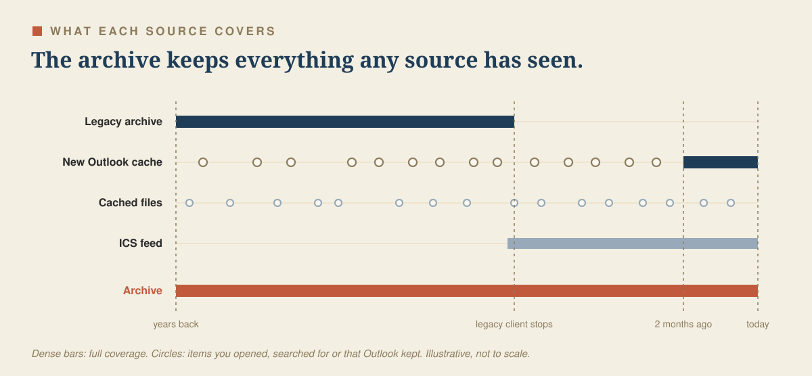

# Data sources

Where the mail comes from, what each source holds, and how the archive combines them.

## Sources

| Source | Where | What it holds | Time coverage | How it is read | Reliability |
|---|---|---|---|---|---|
| Legacy Outlook archive | `Main Profile/Data/`: `Outlook.sqlite`, `Messages/`, `Message Sources/`, `Message Attachments/`, `Events/` | Mail, folders, accounts, attachments, calendar | Everything the legacy client synced, frozen when it stopped (8 Oct 2026 on the author's Mac) | SQLite copy opened immutable, plus `.olk15*` record and block files | High. The schema comes from two open-source parsers and has been checked on real data ([legacy-notes.md](legacy-notes.md)) |
| New Outlook cache | `Main Profile/HxStore.hxd` | Mail, recipients, folders, accounts, attachment records, calendar events | What New Outlook has synced: dense for about the last 2 months, plus older items you opened or searched for | Reverse-engineered container: CRC-checked LZ4 blocks with typed objects | Good. Undocumented format, decoded and checked on a real store ([hxstore-notes.md](hxstore-notes.md)). An Outlook update can change it, which triggers a drift alert |
| New Outlook journal | `Main Profile/hxcore.hfl` | Unknown. Possibly a write-ahead log | n/a | Copied with every snapshot, not parsed yet | Open question |
| Cached files | `Main Profile/Files/S0/<n>/Attachments/`, `EFMData/` | Attachment files and large message bodies, including many whose messages left the cache | Long. Outlook keeps files after the messages are gone | Read in place, read-only. Text is copied into the archive | Good for content. Orphan files have no sender or folder |
| Published calendar (optional) | An ICS link you publish from Outlook on the web | Your calendar | Whatever you publish | HTTPS with ETag caching, only to links you add | High |

## What is not available

These need a server API, which this project does not use:

- Mail that Outlook never cached on this Mac. Searching for it in Outlook makes Outlook download it, and the watcher picks it up within about a minute.
- Sending mail, accepting or declining invitations, editing or deleting events, other people's free/busy, the room finder and out-of-office settings.
- Read state, flags and Bcc on New Outlook mail. These are not decoded yet.

## How sources are combined

Every sync copies the source files to a private folder, parses the copy and merges the result into one archive, `archive.db`.

- Mail is deduplicated by Internet Message-ID. Without one, the key is a hash of sender, date and subject. The same message from the legacy archive and from New Outlook becomes one row.
- The first source to fill a field keeps it. Later sources fill gaps only. Placeholder values (such as an unnamed account or folder) and implausible dates count as empty, so a better source can replace them.
- Calendar events are deduplicated by their iCalendar UID and recurrence id. Here the source with the higher priority wins: New Outlook, then the ICS feed, then the legacy archive.
- The archive only grows. A message that leaves Outlook's cache stays in the archive. The one exception is `purge-excluded` ([privacy.md](privacy.md)).

## Orphan files

New Outlook drops old messages from its cache but often keeps their attachment files and large bodies in `Files/`. Each sync indexes such files that no archived message owns, with their text. The `search_files` tool searches them, and `get_attachment` reads them with an `orphan:<n>` id.

Where a cached body matches an archived message, the file is linked to it. Unlinked files carry the date of the file and have no sender or folder. `sync --no-orphan-files` skips the scan.

## Accounts, and changing institutions

The archive keeps every account it has seen side by side. Each message carries its account address, and every tool can filter by `account`.

If you move to another university or employer that also uses Outlook:

1. Before the old account is switched off, let a sync run (`new-outlook sync` or the watcher). Open or search for anything you want from the server, so Outlook caches it first. Run `new-outlook validate` or `new-outlook coverage` to see what you have.
2. Add the new account to New Outlook on the same Mac. The watcher imports it into the same archive under its own address, next to the old one.
3. When the old account is removed from Outlook, its cache disappears. The archive keeps all mail, attachment text and events it has already seen.
4. Search spans all accounts by default. Pass `account` to a tool to stay within one. You can add privacy rules per account, for example to hide the old employer's mail completely.
5. New Mac: copy `~/Library/Application Support/new-outlook-mcp/` (the archive and `config.toml`) to the new machine and install as in [getting-started.md](getting-started.md).
6. A new institution's calendar can be added as a second ICS feed with its own name.

The default paths point at Outlook's `Main Profile`. If you keep a second Outlook profile, point a separate sync at it with `OUTLOOK_PROFILE_DIR`.

## Attachments

`list_attachments` says for each attachment whether its file is on this Mac. Files are found in three places, in this order: a cached file in `Files/` or the legacy `Message Attachments/`, a cached MIME file, or the raw message source stored in the archive. `get_attachment` extracts text from PDF, Word, Excel, plain text, CSV and calendar files. Attachments stored inside a MIME file or message source are decoded once into the app folder.

An attachment whose file Outlook never downloaded cannot be read. Opening it once in Outlook usually brings it into the cache.
