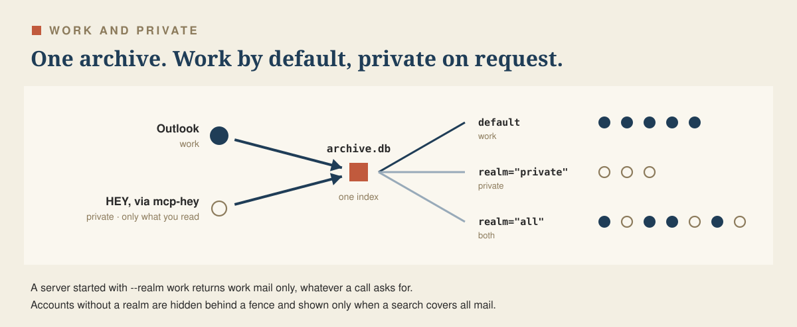

# Work and private mail

The archive can hold more than Outlook. This guide adds the HEY mail you read through [mcp-hey](https://github.com/michalhron/mcp-hey) and keeps it apart from work mail with realms.

<p align="center"></p>

Contents:

- [How it works](#how-it-works)
- [Set up HEY](#set-up-hey)
- [Assign realms](#assign-realms)
- [Searching](#searching)
- [A hard fence](#a-hard-fence)
- [Reference](#reference)

## How it works

- Only the HEY mail you read is added. mcp-hey saves each message you open as an `.eml` file. new-outlook-mcp imports that folder, and search by meaning embeds the new mail like any other. Your HEY mailbox is never exported as a whole, so the archive grows by about what you read.
- No extra requests go to HEY. mcp-hey already downloads each message's original to list its attachments. The archive copy is that same download.
- new-outlook-mcp still reads only local files. The network stays in mcp-hey, which holds your HEY login.
- Each account belongs to a realm, `work` or `private`. Searches cover work mail unless you ask for private mail.
- A message that exists in both mailboxes, for example one you sent from HEY to your university address, is stored once. Both copies carry the same Message-ID.

## Set up HEY

1. In the mcp-hey entry of your Claude configuration, set `HEY_ARCHIVE_DIR`:

   ```json
   "hey": {
     "command": "bun",
     "args": ["run", "/absolute/path/to/mcp-hey/src/index.ts"],
     "env": { "HEY_ARCHIVE_DIR": "~/Mail/hey-archive" }
   }
   ```

   Keep the folder out of iCloud Drive, Dropbox and other synced folders. It holds the full text of your mail.

2. Tell new-outlook-mcp about the folder and which account its mail belongs to:

   ```sh
   new-outlook eml add hey ~/Mail/hey-archive --account you@hey.com
   new-outlook eml list
   ```

3. Import:

   ```sh
   new-outlook sync --source eml
   ```

   After that, the watcher imports new files within about a minute, and the 36-hour job covers the rest. Install or reinstall the watcher (`new-outlook launchd install --watch`) after adding the folder so it watches it too.

Any folder of `.eml` files works the same way. Each folder gets its own name, which becomes the folder shown in the archive.

## Assign realms

```sh
new-outlook realm add work you@university.example "@university.example" ics:work
new-outlook realm add private you@hey.com
new-outlook realm show
```

An entry is an account name or address, matched exactly and ignoring case, or `@domain`, which also matches subdomains. Exact entries win over domain entries. `ics:<name>` is the account of a published calendar feed. `realm show` lists every account in the archive with its realm.

An account that matches no entry is `unassigned`. It appears only in searches over all mail and never behind a fence. A new account cannot slip into the work view by accident.

The table lives in `config.toml`:

```toml
[realms]
work    = ["you@university.example", "@university.example", "ics:work"]
private = ["you@hey.com"]
files   = "work"   # cached Outlook files that no message owns
default = "work"   # what searches cover when a call names no realm: work, private or all
```

A typo or an unknown key stops the tools with an error. Nothing is shown from a realm table that cannot be read.

## Searching

Once realms are assigned:

- `search_emails`, `semantic_search`, `find_similar` and `list_recent` cover work mail by default.
- Each takes `realm`: `work`, `private` or `all`. Ask Claude about your private mail and it passes `realm: "private"`.
- Every result carries its `realm`, and every search says which realm it covered (`realm_searched`), with a note when other mail was left out.
- Opening a message by its id (`get_email`, `get_thread`, attachments) works in any realm, so a private message found on request can be read.
- The calendar tools, including the related mail in `meeting_prep`, are not filtered by the default realm. Only a hard fence filters them.

From the terminal: `new-outlook search "landlord" --realm private`.

## A hard fence

For a Claude setup that must never see private mail, start the server with a fence:

```sh
claude mcp add new-outlook-work -- new-outlook-mcp --realm work
```

Behind a fence:

- Every tool returns only that realm, whatever a call asks for: search, search by meaning, threads, attachments, folders, counts, the calendar and orphan files.
- Accounts without a realm and mail without an account are hidden too.
- Cached Outlook files that no message owns follow the `files` realm.
- Importing and `purge-excluded` ignore the fence. A fenced server's `sync_now` still imports private mail, and purging never deletes mail because of a fence.

`NEW_OUTLOOK_REALM=work` in the server's environment does the same as `--realm work`. Without either, there is no fence.

## Reference

| Command | Does |
|---|---|
| `new-outlook eml add NAME PATH --account ADDRESS` | Import `.eml` files from a folder as one account |
| `new-outlook eml list` / `remove NAME` | Show or remove folders. Removing keeps the mail already imported. |
| `new-outlook realm add work\|private ENTRY ...` | Assign accounts or `@domains`. An entry moves out of the other realm. |
| `new-outlook realm remove ENTRY ...` / `show` | Remove entries, or list realms and every account's realm |
| `new-outlook-mcp --realm work\|private\|all` | Hard fence for this server |

Code: `realms.py` (realm table and fence), `privacy.py` (where the fence is applied), `importers/eml.py` (the folder importer). Tests: `tests/test_realms.py`, `tests/test_eml.py`.
